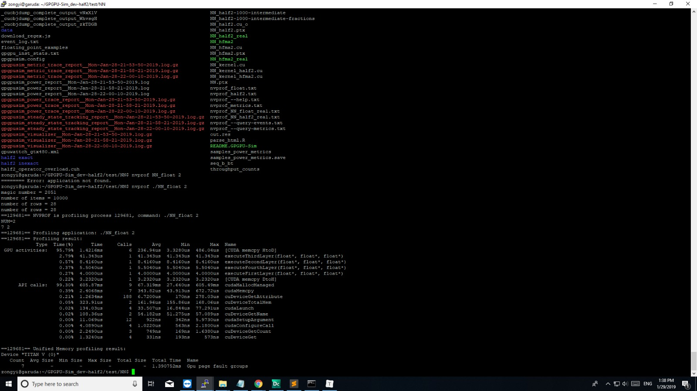

##	Review

###		Manual

​	This manual is very long and detailed, and read it together with Kaichun's report.

​	To me, the most important part of Kaichun's report is **BASIC OBSERVATIONS AND SIMULATIONS**.

Some conceptions like **kernal**, **warp**, **SM** = **SIMT** = **CU** .

​	The overall process, **fetch, decode, issue, read operands, execute, writeback**.

​	Mainly dig into the part **issue & read operands**, which is mainly done by the **operand collector**

###	some explorations about nvprof

​	Though we will do the remaining job mainly with **CUPTI**, I found **nvprof** is easier and lighter. So, I first try to use **nvprof** to do the similar work as what CUPTI will do. There is no obvious reason, but I just want to try first, since CUPTI manual is very long.



​	This is to use it in the command line. Next, I want to write a script and save all the output in the terminal as a file, so I do the following things:

 * write a script to run the application using **system("xxxx")**

 * use **script** to save the output to a file

   This method works. All the output is saves as a file, and we can refer to it conveniently.

   

   Maybe in the future when we need to use CUPTI to output and debug, we can use the same method.

   ##	CUPTI

   It is a little difficult for me now, these are what I did:

   * **read the manual (a part)**

     To figure out some basic knowledge about **CPUTI**, and know its four types of API(**Activity, Callback,Event, Metric**). The most important API for us I think is the **Activity API**

     I have not got my hands dirty enough, and its results and programming methods seem very strange to me right now.:( 

     But at least , can dig into it, for instance, the output of CUPTI is like the following:

     > ```
     > Event Trace
     > _Z6kernelIPfEvT_i: (active_warps,1734) (gst_inst_32bit,100) (active_cycles,423) 
     > _Z7kernel2IPfEvT_i: (active_warps,865) (gst_inst_32bit,50) (active_cycles,418) 
     > 
     > Metric Trace
     > _Z6kernelIPfEvT_i: (flop_count_dp,0) (flop_count_sp,100) (inst_executed,52) 
     > _Z7kernel2IPfEvT_i: (flop_count_dp,0) (flop_count_sp,50) (inst_executed,26) 
     > ```

   It is very strange to me at present.... Need to get more familiar with it.

   ##	Questions

   ###	What is our final goal?

   My past understanding is that our project's final goal is to **speed up GPGPU-Sim**. The detailed methods we discussed last week seem reasonable.

   But, is GPGPU-Sim the necessary thing? I suppose it is, because we want to speed up it. Without GPGPU-Sim, our final goal is not meaningful.

   ###	Time

   And in this week, I found that it is a little hard for me to get the progress quickly. 

   Meanwhile, I found it takes much time to read the manual throughout, if we want to finish our goal, can I just read the necessary parts? 

   eg, I do not have to get clear about how **Operand Collector** works, I do not have to know much about **Interconnection port**...whether it is FIFO or not will not stand in my way right now.

   ###	Strategy

   There are two main methods of improving myself:

   * **theory**, eg.reading papers , manuals, reports or others

   * **practice**, eg. programming without digging into GPGPU-Sim mechanism, just the output. If we have to make entrypoints in the future, read then.

     Which is more suitable?

     

     

     

     

     ##	Plan

     

     * Manual?
     * CUPTI to trace the application
     * transfer information to GPUWattch